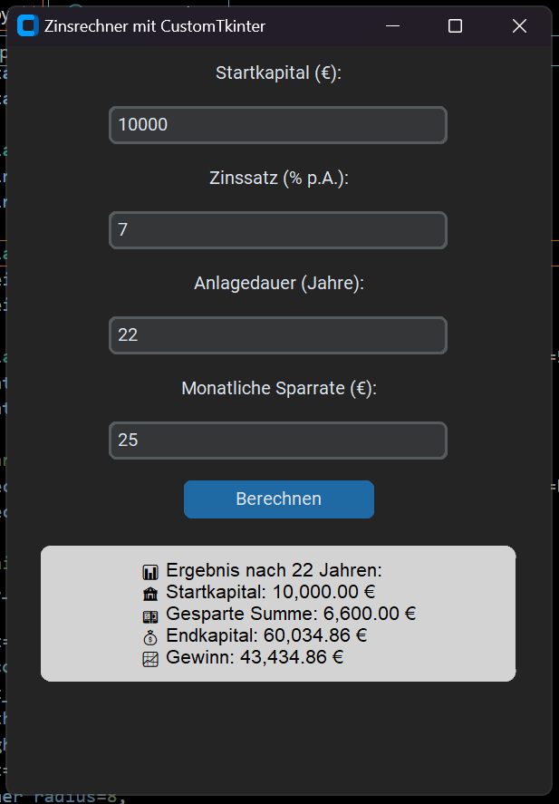

# Zinsrechner mit CustomTkinter

## ✨ Einleitung
Dieses Projekt ist ein **grafischer Zinsrechner**, der mit **CustomTkinter** in Python entwickelt wurde. Die Anwendung erlaubt es, die langfristige Entwicklung einer Geldanlage unter Berücksichtigung von Zinsen und monatlichen Einzahlungen zu berechnen.

Der Zinsrechner wurde als **Windows-exe-Datei** unter dem Ordner `dist` erstellt, sodass die Anwendung ohne Python-Installation direkt gestartet werden kann.

---

## Hauptansicht der GUI


---

## 🔧 Funktionen
- **Benutzerfreundliche GUI** mit CustomTkinter.
- Berechnung von **Endkapital und gesparter Summe** nach einer bestimmten Laufzeit.
- **Berücksichtigung von monatlichen Sparbeträgen und Zinssatz** (p.A.).
- Anzeige des **bereinigten Gewinns** (tatsächlicher Ertrag nach Abzug aller Einzahlungen).
- Fehlerbehandlung für ungültige Eingaben.

---

## 💻 Systemvoraussetzungen
- **Windows 10/11** (getestet, sollte aber auch unter älteren Versionen funktionieren).
- **Python 3.x** (nur für die Entwicklung erforderlich, nicht für die Nutzung der exe-Datei).

---

## 🛠️ Installation & Ausführung
### **Falls du die exe-Datei nutzen willst:**
1. Navigiere in den `dist/` Ordner.
2. Starte `zinsrechner.exe` per Doppelklick.

### **Falls du den Code ausführen möchtest:**
1. Stelle sicher, dass **Python 3.x** installiert ist.
2. Installiere die benötigten Pakete mit:
   ```bash
   pip install customtkinter
   ```
3. Starte das Skript mit:
   ```bash
   python zinsrechner.py
   ```

---

## 🛠️ Erstellen der .exe-Datei
Falls du die Anwendung selbst in eine `.exe` umwandeln willst, kannst du **PyInstaller** nutzen:

1. Installiere PyInstaller:
   ```bash
   pip install pyinstaller
   ```
2. Erstelle die exe-Datei mit folgendem Befehl:
   ```bash
   pyinstaller --onefile --windowed zinsrechner.py
   ```
3. Die fertige Datei befindet sich nun im `dist/` Ordner.

---

## 📈 Beispielrechnung
### **Eingaben:**
- Startkapital: 1.000 €
- Zinssatz: 5% p.A.
- Laufzeit: 5 Jahre
- Monatliche Sparrate: 100 €

### **Ausgabe in der GUI:**
```
🎯 Ergebnis nach 5 Jahren:
🏦 Startkapital: 1.000,00 €
💵 Gesparte Summe: 6.000,00 €
💰 Endkapital: 8.114,42 €
📈 Gewinn: 1.114,42 €
```

---

## 🔄 Weiterentwicklung
Falls du das Projekt erweitern willst, hier einige Ideen:
- **Grafische Darstellung der Zinsentwicklung** mit `matplotlib`.
- **Möglichkeit zur Speicherung der Berechnungen** als `.csv` oder `.txt`.
- **Zusätzliche Funktionen wie Inflation oder Steuerabzug** berücksichtigen.

---

## 🌟 Fazit
Dieses Projekt war eine spannende Einführung in **CustomTkinter**, um eine moderne und benutzerfreundliche GUI in Python zu erstellen. Durch die Verwendung von **PyInstaller** wurde eine eigenständige `.exe`-Datei erzeugt, die sofort ausgeführt werden kann.

Viel Spaß beim Rechnen mit Zinsen! 🚀


